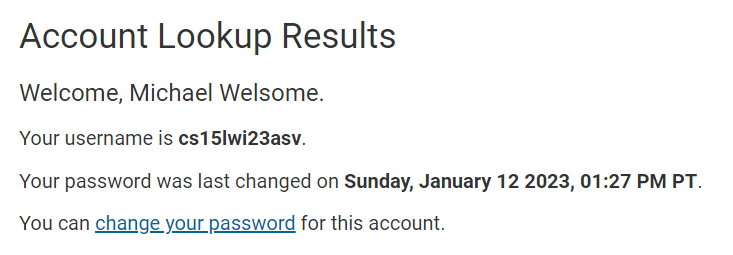
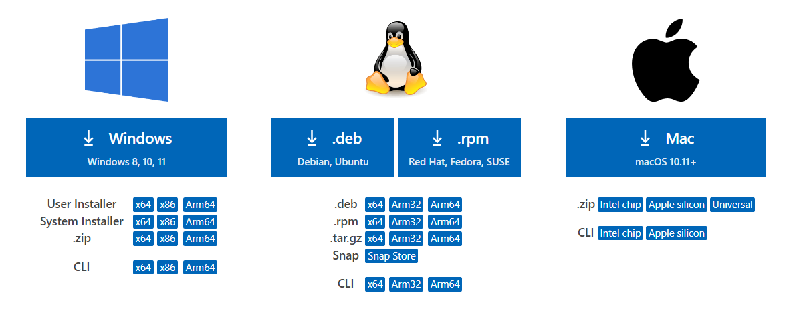
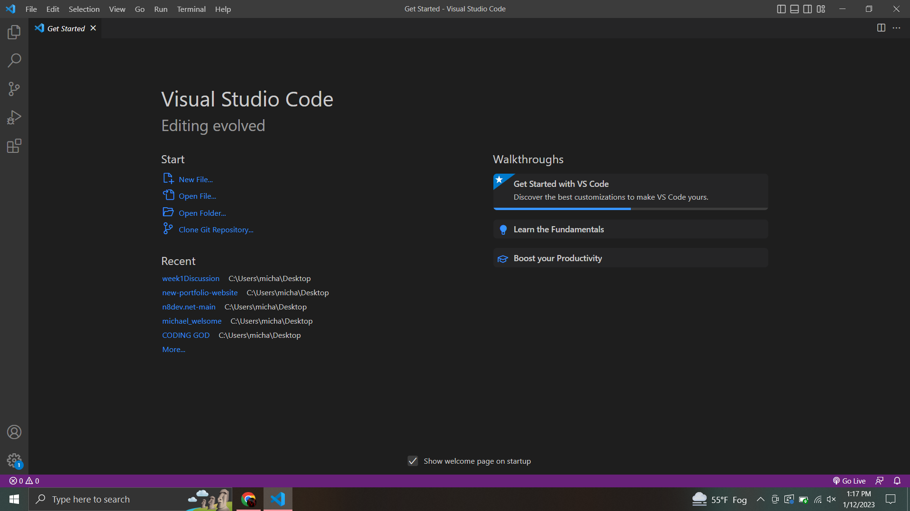
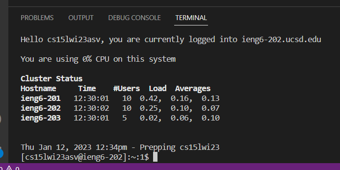
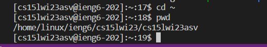

# Week 1 Lab Report
---
# How to gain remote access to your ieng6 account
## for incoming CSE15L students
* You will first need to access your course-specific account
* Look it up through this link [here](https://sdacs.ucsd.edu/~icc/index.php).
* Once you find it, you will need to reset your password 
* Click on *cs15lwi23xxx resources* (where the xxx is 3 random letters)
* You will be prompted to set your password if you need to
* If your password has been reset correctly, it should look like this:

* Note: it may take up to around 15 minutes to reset your password
* Now, you can install Visual Studio Code
* I already had it installed
* If you don't, go to this link [here](https://code.visualstudio.com/download)
* This should be displayed:

* Click on your designated OS and follow instructions displayed to install
* Once installed, open VSCode
* It should look like this (possibly in light mode):

* Now if your password has fully reset, you are ready to remotely connect
* If you are on Windows, you should install `git` [here](https://git-scm.com/downloads)
* Once that is done, open up a Bash terminal within VSCode
* To login to your remote account, type `ssh cs15lwi23xxx@ieng6.ucsd.edu` where the `xxx` is your 3 letters
* Once you enter that in, there will be a long error-like message because it is your first time connecting to the server; just enter in yes to bypass it
* Now, you should be connected to the remote! Your terminal should look something like this:

* The commands you place are now going to be run on the remote server
* Now finally you can enter in some commands to play around with the remote terminal
* There are many commands you can try like: `cd`, `ls`, `cat`, `pwd`, and more you can search up
* `cd` will change the directory to a specified directory of your choosing
* `ls` will list the files inside your current directory
* `cat` will take different directories and display their contents concatenated together in your terminal
* `pwd` will display your current directory in the terminal
* After messing around with changing directories and such, you can type `cd ~` to return to your home directory
* Here is an example of that:

* As you can see, after entering `pwd`, we are placed back into the home directory
* When you are done, you can log out of the remote server
* To do this, press Ctrl and D or type `exit` in the terminal
* And you are done! You now know how to remotely access your account!
* Thank you for reading
