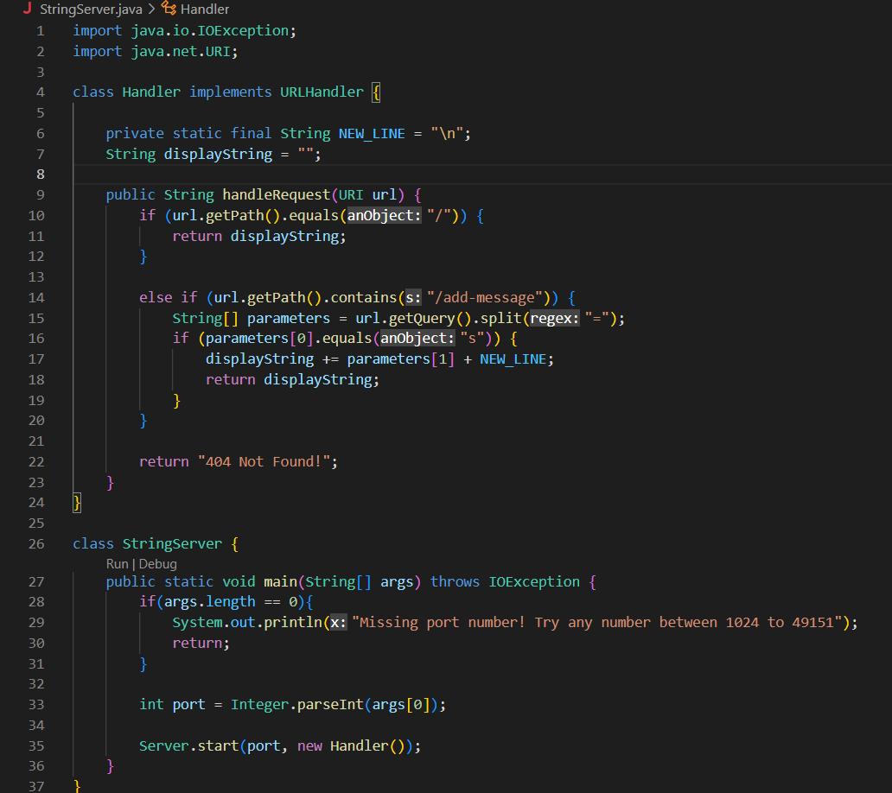
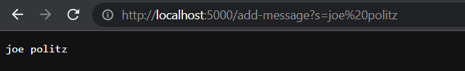
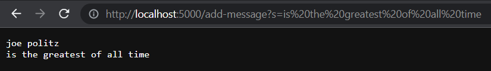
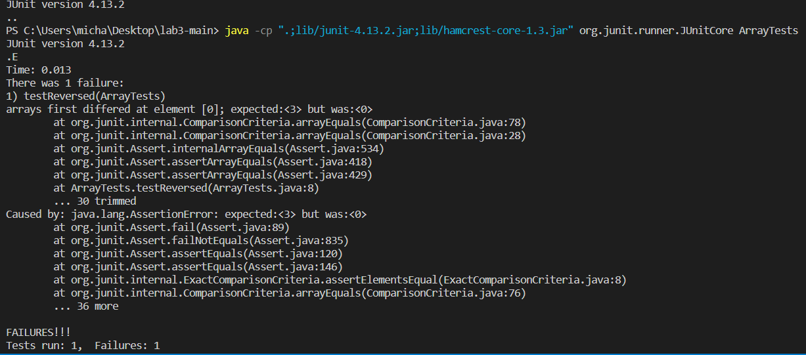
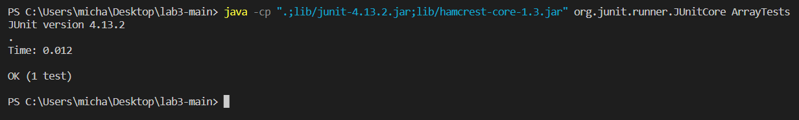

# Week 2 Lab Report
---
# Part 1
Here is the code for `StringServer.java`:



Here is me using `/add-message` to display "joe politz" on the website:



For this output, we call the `handleRequest` method in the `StringServer.java` file. After it sees that the path contains `add-message?s=` then it adds the query (everything after the `=`) and a new line to the `displayString` (which was empty before this) and displays it on the page. Because of this, the `displayString` is concatenated with the query and a new line. 

**Note: the `%20` between "joe" and "politz" is there because URLs can't have spaces. The `%20` represents a space.**

Here is me using `/add-message` to display "is the greatest of all time" on the website:



For this output aswell, we call the `handleRequest` method in the `StringServer.java` file. It sees the path contains `add-message?s=` and adds the query and a new line to the `displayString`. The value of the `displayString` before the new query is concatanated, is "joe politz (NEW LINE)". Now, the `displayString` is changed to have "joe politz (NEW LINE) is the greatest of all time (NEW LINE)".

# Part 2
I chose the buggy `reversed` method inside the array. Here is the method:
```
// Returns a *new* array with all the elements of the input array in reversed
// order
static int[] reversed(int[] arr) {
  int[] newArray = new int[arr.length];
  for(int i = 0; i < arr.length; i += 1) {
    arr[i] = newArray[arr.length - i - 1];
  }
  return arr;
}
```

Here is a failure-inducing input as a JUnit test:
```
@Test
public void testReversed() {
  int[] input1 = { 1, 2, 3 };
  assertArrayEquals(new int[]{ 3, 2, 1 }, ArrayExamples.reversed(input1));
}
```
When you run this test, the `reversed` method returns an array `{ 0, 0, 0 }` which is definitely not intended.

Here is an input that wouldn't induce failure as a JUnit test:
```
@Test
public void testReversed() {
  int[] input1 = { 0, 0, 0 };
  assertArrayEquals(new int[]{ 0, 0, 0 }, ArrayExamples.reversed(input1));
}
```
When you run this test, the `reversed` method returns an array `{ 0, 0, 0 }` which, coincidentally, is intended.

Here is the output of running the previous two JUnit tests respectively:






Here is the code with the bug in it:
```
static int[] reversed(int[] arr) {
  int[] newArray = new int[arr.length];
  for(int i = 0; i < arr.length; i += 1) {
    arr[i] = newArray[arr.length - i - 1];
  }
  return arr;
}
```

And here is the code after fixing the bug:
```
static int[] reversed(int[] arr) {
  int[] newArray = new int[arr.length];
  for(int i = 0; i < arr.length; i += 1) {
    newArray[arr.length - i - 1] = arr[i];
  }
  return newArray;
}
```

This fix solves two main bugs. The first is that the method should've been returning a *new* array. I fixed this by returning the `newArray` instead of the input `arr`. The second is that the method was just returning 0's. This was fixed by swapping the order of what is assigned in the for loop. Instead of copying the empty `newArray` to `arr`, I did the opposite.

# Part 3
While it may seem trivial, I learned that you can start a web server using java. I have previously had that that web development could only be accomplished through HTML and CSS, but this has shown me that's false. I also wasn't completely sure on how queries worked, and lab 2 more than cleared that up for me. It showed me all the awesome things you could do with just changing the URL. In conclusion, I've learned a lot from these past two labs.

**Thank you for reading!**

